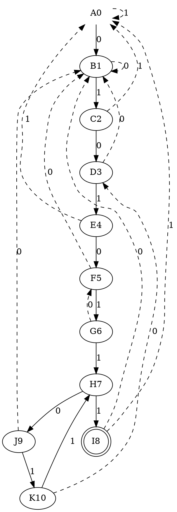



# HackMD 額外功能

[](https://hackmd.io/kvD8r4l1RP6WcT6CzlD27w)

這裡是一些 HackMD 擴充的語法。

## Inline

HackMD 增加惹一些行內元素的支援。

### Sources

```markdown
Wrap words in ++two consecutive plus signs++ to ++underline++ them.

Wrap words in ==two consecutive equal signs== to ==highlight== them.

Wrap words in ^carets^ to make them ^superscript^.

Wrap words in ~tildes~ to make them ~subscript~.
```
### Results

Wrap words in ++two consecutive plus signs++ to ++underline++ them.

Wrap words in ==two consecutive equal signs== to ==highlight== them.

Wrap words in ^carets^ to make them ^superscript^.

Wrap words in ~tildes~ to make them ~subscript~.

## Quotes w/ additional attributions

引言區塊可以標註名字、時間，並自訂 border 的顏色。

### Sources

```markdown
> Can anybody find me somebody to love?
> 
> Each morning I get up I die a little \
> Can barely stand on my feet \
> Take a look in the mirror and cry \
> Lord, what you're doing to me? \
> I have spent all my years in believing you \
> But I just can't get no relief, Lord \
> Somebody, somebody \
> Can anybody find me somebody to love?
>
> 
>
> [name=Queen][time=1976][color=#F2D0A7]
```

### Results

> Can anybody find me somebody to love?
> 
> Each morning I get up I die a little \
> Can barely stand on my feet \
> Take a look in the mirror and cry \
> Lord, what you're doing to me? \
> I have spent all my years in believing you \
> But I just can't get no relief, Lord \
> Somebody, somebody \
> Can anybody find me somebody to love?
>
> 
>
> [name=Queen][time=1976][color=#F2D0A7]

## Definition list

可以對應到 HTML 的 `<dl>`, `<dt>` & `<dd>` tags 及 $\LaTeX$ 的 `description` environment.

### Sources

```markdown
Term A
: Definition a
: Definition b

Term B
: Definition
```

### Results

Term A
: Definition _a_
: Definition **b**

Term B
: Definition

## Blocks

HackMD 支援四種顏色 blocks（對應到 Bootstrap?）以及可折疊的 blocks.

### Sources

```markdown
:::success
This is a **success** block.
:::

:::info
This is a _info_ block.
:::

:::warning
This is a _**warning**_ block.
:::

:::danger
This is a `danger` block.
:::

:::spoiler
This is a ~~spoiler~~ block.
:::

:::spoiler Custom Caption
This is a ~~spoiler~~ w/ custom caption block.
:::
```

### Results

:::success
This is a **success** block.
:::

:::info
This is a _info_ block.
:::

:::warning
This is a _**warning**_ block.
:::

:::danger
This is a `danger` block.
:::

:::spoiler
This is a ~~spoiler~~ block.
:::

:::spoiler Custom Caption
This is a ~~spoiler~~ w/ custom caption block.
:::

## Include external contents

我們可以容易地在 HackMD 中嵌入一些外部內容。

### Sources

```markdown
:::spoiler YouTube

:::

:::spoiler GitHub Gist

:::

:::spoiler PDF
{%pdf https://m110.nthu.edu.tw/~s110062219/ICPC/2022-Asia%20Taipei%202021-Mr.%20Chun-Mu%20Weng-MEDAL.pdf %}
:::

:::spoiler HackMD

:::
```

### Results

:::spoiler YouTube

:::

:::spoiler GitHub Gist

:::

:::spoiler PDF
{%pdf https://m110.nthu.edu.tw/~s110062219/ICPC/2022-Asia%20Taipei%202021-Mr.%20Chun-Mu%20Weng-MEDAL.pdf %}
:::

:::spoiler HackMD

:::

## Graph & diagram

HackMD 還支援繪製一系列的圖表，比較通用的有 [Graphviz](https://en.wikipedia.org/wiki/Graphviz), Mermiad 等。

### Sources

````markdown
:::spoiler Graphviz

:::
````

### Results

:::spoiler Graphviz

:::

## $\LaTeX$

HackMD 透過 [MathJax](https://en.wikipedia.org/wiki/MathJax) 支援數學式子的顯示。

### Sources

```markdown
This is an inline math expression: $(1-x)^{-n}=\sum_{i=0}^\infty\binom{-n}{i}(-x)^i=\sum_{i=0}^\infty(-1)^i\binom{n+i-1}{i}(-x)^i$.

And the following is a display math expression: $$\begin{pmatrix}A_{0,0}&A_{0,1}\\A_{1,0}&A_{1,1}\end{pmatrix}=\begin{pmatrix}I&O\\A_{1,0}A_{0,0}^{-1}&I\end{pmatrix}\begin{pmatrix}A_{0,0}&O\\O&A_{1,1}-A_{1,0}A_{0,0}^{-1}A_{0,1}\end{pmatrix}\begin{pmatrix}I&A_{0,0}^{-1}A_{0,1}\\O&I\end{pmatrix}$$
```

### Results

This is an inline math expression: $(1-x)^{-n}=\sum_{i=0}^\infty\binom{-n}{i}(-x)^i=\sum_{i=0}^\infty(-1)^i\binom{n+i-1}{i}(-x)^i$.

And the following is a display math expression: $$\begin{pmatrix}A_{0,0}&A_{0,1}\\A_{1,0}&A_{1,1}\end{pmatrix}=\begin{pmatrix}I&O\\A_{1,0}A_{0,0}^{-1}&I\end{pmatrix}\begin{pmatrix}A_{0,0}&O\\O&A_{1,1}-A_{1,0}A_{0,0}^{-1}A_{0,1}\end{pmatrix}\begin{pmatrix}I&A_{0,0}^{-1}A_{0,1}\\O&I\end{pmatrix}$$
